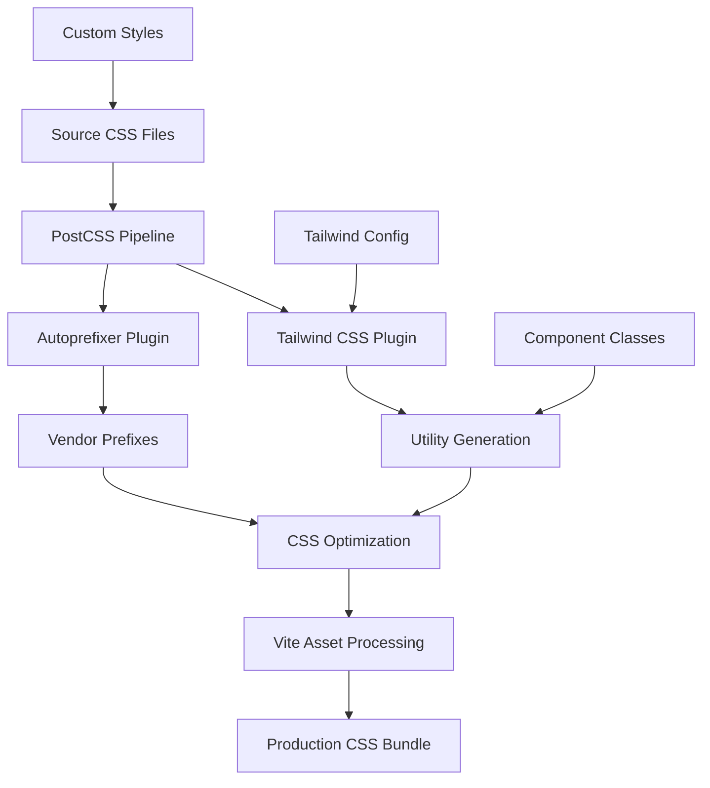

# Design Document: Production Styling Fix

## Overview

This design transforms the Glimmer React/Vite application from using Tailwind CSS via CDN to a proper build-time CSS processing pipeline. The solution integrates Tailwind CSS with PostCSS in the Vite build system, ensuring optimal performance, reliable asset delivery, and maintainable styling configuration.

The architecture leverages Vite's native CSS processing capabilities combined with PostCSS plugins to create a robust styling pipeline that generates optimized, tree-shaken CSS bundles for production while maintaining excellent developer experience.

## Architecture

The styling system follows a build-time processing architecture:



### Core Components

1. **CSS Entry Point**: A main CSS file that imports Tailwind directives and custom styles
2. **PostCSS Pipeline**: Processes CSS through Tailwind and optimization plugins
3. **Tailwind Configuration**: Defines custom theme, colors, and font families
4. **Vite Integration**: Handles CSS bundling, optimization, and asset management
5. **Asset Delivery**: Serves optimized CSS with proper MIME types

## Components and Interfaces

### CSS Processing Pipeline

**CSS Entry Point** (`src/index.css`):
```css
@tailwind base;
@tailwind components;
@tailwind utilities;

/* Custom base styles */
@layer base {
  body {
    font-family: 'Inter', sans-serif;
    background-color: theme('colors.navy.900');
    color: theme('colors.gray.100');
  }
  
  h1, h2, h3, h4, h5, h6 {
    font-family: 'Plus Jakarta Sans', sans-serif;
  }
}

/* Custom components */
@layer components {
  .scrollbar-custom {
    scrollbar-width: thin;
    scrollbar-color: theme('colors.navy.700') theme('colors.navy.900');
  }
  
  .scrollbar-custom::-webkit-scrollbar {
    width: 8px;
    background: theme('colors.navy.900');
  }
  
  .scrollbar-custom::-webkit-scrollbar-thumb {
    background: theme('colors.navy.700');
    border-radius: 4px;
  }
  
  .scrollbar-custom::-webkit-scrollbar-thumb:hover {
    background: theme('colors.coral.500');
  }
}
```

**PostCSS Configuration** (`postcss.config.js`):
```javascript
export default {
  plugins: {
    tailwindcss: {},
    autoprefixer: {},
  },
}
```

**Tailwind Configuration** (`tailwind.config.js`):
```javascript
/** @type {import('tailwindcss').Config} */
export default {
  content: [
    "./index.html",
    "./src/**/*.{js,ts,jsx,tsx}",
  ],
  theme: {
    extend: {
      colors: {
        navy: {
          900: '#141827',
          800: '#1F2642',
          700: '#2A3356',
        },
        coral: {
          500: '#F65058',
          600: '#D93E46',
        }
      },
      fontFamily: {
        serif: ['"Plus Jakarta Sans"', 'sans-serif'],
        sans: ['Inter', 'sans-serif'],
      }
    }
  },
  plugins: [],
}
```

### Vite Integration

**Enhanced Vite Configuration** (`vite.config.ts`):
```typescript
import { defineConfig } from 'vite';
import react from '@vitejs/plugin-react';

export default defineConfig({
  plugins: [react()],
  css: {
    postcss: './postcss.config.js',
    devSourcemap: true,
  },
  build: {
    cssCodeSplit: false, // Single CSS file for better caching
    rollupOptions: {
      output: {
        assetFileNames: (assetInfo) => {
          if (assetInfo.name?.endsWith('.css')) {
            return 'assets/styles.[hash].css';
          }
          return 'assets/[name].[hash].[ext]';
        },
      },
    },
  },
});
```

### HTML Template Updates

**Updated HTML Template** (`index.html`):
```html
<!DOCTYPE html>
<html lang="en">
  <head>
    <meta charset="UTF-8" />
    <meta name="viewport" content="width=device-width, initial-scale=1.0" />
    <meta name="theme-color" content="#141827">
    <title>Glimmer</title>
    
    <!-- Font preloading for performance -->
    <link rel="preconnect" href="https://fonts.googleapis.com">
    <link rel="preconnect" href="https://fonts.gstatic.com" crossorigin>
    <link href="https://fonts.googleapis.com/css2?family=Plus+Jakarta+Sans:ital,wght@0,300;0,400;0,500;0,600;0,700;0,800;1,400;1,500&family=Inter:wght@300;400;500;600&display=swap" rel="stylesheet">
    
    <!-- Remove Tailwind CDN and inline config -->
    <!-- CSS will be injected by Vite -->
  </head>
  <body class="bg-navy-900 text-gray-100 antialiased h-screen overflow-hidden selection:bg-coral-500 selection:text-white scrollbar-custom">
    <div id="root">
      <div class="flex items-center justify-center h-screen flex-col gap-4 text-gray-500 animate-pulse">
        <div class="w-12 h-12 border-4 border-coral-500 border-t-transparent rounded-full animate-spin"></div>
        <p>Loading Glimmer...</p>
      </div>
    </div>
    <script type="module" src="/src/main.tsx"></script>
  </body>
</html>
```

## Data Models

### Configuration Models

**Tailwind Theme Configuration**:
```typescript
interface TailwindTheme {
  colors: {
    navy: {
      900: string;
      800: string;
      700: string;
    };
    coral: {
      500: string;
      600: string;
    };
  };
  fontFamily: {
    serif: string[];
    sans: string[];
  };
}
```

**Build Configuration**:
```typescript
interface BuildConfig {
  cssCodeSplit: boolean;
  assetFileNames: (assetInfo: AssetInfo) => string;
  sourcemap: boolean;
}
```

### Asset Processing Models

**CSS Asset**:
```typescript
interface CSSAsset {
  source: string;
  processed: string;
  hash: string;
  size: number;
  dependencies: string[];
}
```

Now I need to use the prework tool to analyze the acceptance criteria before writing correctness properties:

<function_calls>
<invoke name="prework">
<parameter name="featureName">production-styling-fix

## Correctness Properties

*A property is a characteristic or behavior that should hold true across all valid executions of a system—essentially, a formal statement about what the system should do. Properties serve as the bridge between human-readable specifications and machine-verifiable correctness guarantees.*

### Property 1: Build Output Optimization
*For any* application build, the build system should generate exactly one optimized CSS file that contains only the Tailwind utilities and custom styles that are actually used in the codebase, with unused utilities tree-shaken out.
**Validates: Requirements 1.1, 5.1**

### Property 2: PostCSS Processing Pipeline
*For any* CSS file containing @tailwind directives, the PostCSS pipeline should transform these directives into actual CSS rules and apply autoprefixer transformations for browser compatibility.
**Validates: Requirements 1.2, 2.3**

### Property 3: CDN Reference Removal
*For any* built HTML output, the file should contain no references to cdn.tailwindcss.com and should include local CSS file references instead.
**Validates: Requirements 1.3, 1.4**

### Property 4: Custom CSS Preservation
*For any* custom CSS rules (including scrollbar styles, font configurations, and component styles), the CSS pipeline should preserve and process them correctly alongside Tailwind utilities in the final output.
**Validates: Requirements 2.2, 3.3**

### Property 5: Production Optimization
*For any* production build, the CSS pipeline should generate minified, optimized CSS output that is smaller in size than development builds.
**Validates: Requirements 2.4, 5.3**

### Property 6: Font Asset Management
*For any* font family references in the application, the build system should preserve font loading links and ensure proper font family declarations in the generated CSS.
**Validates: Requirements 3.1, 3.4**

### Property 7: Custom Theme Generation
*For any* custom theme values defined in the Tailwind configuration (colors, fonts), the Tailwind engine should generate corresponding utility classes that are available in the final CSS bundle.
**Validates: Requirements 3.2, 7.2**

### Property 8: Asset Path Generation
*For any* generated assets, the build system should create relative paths that work correctly with static hosting environments.
**Validates: Requirements 4.3**

### Property 9: Source Map Configuration
*For any* build mode, the CSS pipeline should generate source maps for development builds and exclude them from production builds.
**Validates: Requirements 5.2**

### Property 10: Asset Hashing
*For any* built assets, the build system should include hash suffixes in filenames for proper cache busting.
**Validates: Requirements 5.4**

### Property 11: Backward Compatibility
*For any* existing Tailwind utility class used in the current application, the new build system should generate CSS that produces identical visual output to the CDN version.
**Validates: Requirements 8.1, 8.2, 8.4**

### Property 12: Custom CSS Functionality
*For any* custom CSS selectors and rules currently in use, the build system should preserve their functionality in the final output.
**Validates: Requirements 8.3**

## Error Handling

### CSS Processing Errors
- **Invalid Tailwind Configuration**: Build should fail with clear error messages indicating configuration issues
- **Missing PostCSS Plugins**: Build should fail if required plugins are not installed
- **CSS Syntax Errors**: Build should provide line numbers and context for CSS parsing errors
- **Asset Resolution Failures**: Build should fail gracefully when fonts or other assets cannot be resolved

### Development Experience
- **Hot Reload Failures**: Development server should recover gracefully from CSS processing errors
- **Configuration Validation**: Invalid Tailwind configurations should be caught early with helpful error messages
- **Plugin Compatibility**: Version mismatches between PostCSS plugins should be detected and reported

### Deployment Considerations
- **MIME Type Configuration**: Provide clear documentation for configuring hosting platforms to serve CSS with correct MIME types
- **Asset Path Issues**: Include fallback strategies for asset path resolution in different hosting environments
- **Build Output Validation**: Verify that all required assets are present in the build output

## Testing Strategy

### Dual Testing Approach
The testing strategy combines unit tests for specific scenarios with property-based tests for comprehensive coverage:

**Unit Tests** focus on:
- Specific configuration examples (PostCSS config, Tailwind config)
- Error conditions and edge cases
- Integration points between build tools
- Specific CSS transformations

**Property-Based Tests** focus on:
- Universal properties across all CSS inputs
- Build output consistency across different component combinations
- Asset generation patterns
- CSS optimization behaviors

### Property-Based Testing Configuration
- **Testing Library**: Use Vitest with custom property test utilities
- **Minimum Iterations**: 100 iterations per property test
- **Test Tagging**: Each property test must reference its design document property
- **Tag Format**: `Feature: production-styling-fix, Property {number}: {property_text}`

### Test Categories

**Build System Tests**:
- Verify CSS file generation and optimization
- Test asset hashing and path generation
- Validate source map generation based on build mode
- Test tree-shaking effectiveness

**CSS Processing Tests**:
- Verify PostCSS pipeline functionality
- Test Tailwind directive processing
- Validate custom CSS preservation
- Test autoprefixer integration

**Configuration Tests**:
- Test Tailwind configuration loading
- Verify custom theme generation
- Test error handling for invalid configurations
- Validate plugin compatibility

**Integration Tests**:
- Test complete build pipeline from source to output
- Verify HTML template processing
- Test font loading and asset references
- Validate deployment-ready output

Each property-based test should run a minimum of 100 iterations to ensure comprehensive coverage through randomization, while unit tests provide targeted validation of specific examples and edge cases.